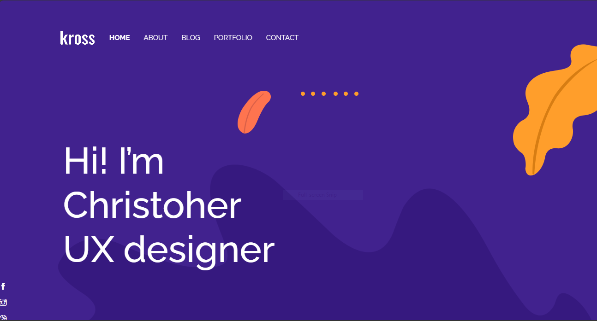

# Kross — Creative Portfolio Template

Professional Symfony 7 portfolio template designed for showcasing creative work, case studies, and client projects. This repository contains a ready-to-run Symfony application that serves a static portfolio built with Twig and several frontend libraries.

Repository: [https://github.com/Dieu-Merci-Ndenga/Symfony-KroosProject]

## Key technologies

- Symfony 7
- Twig
- CSS & Bootstrap
- JS & jQuery
- themi-icons
- slick-carousel
- Shuffle

## Overview

The project ships with static assets under `public/` (CSS, JavaScript and images) and Twig templates in `templates/`. It is intended to be run locally for demonstration purposes or deployed as a simple Symfony application.

## Quick contract

- Inputs: local machine with PHP, Composer (and optionally the Symfony CLI)
- Output: a local web server serving the site at `http://127.0.0.1:8000`
- Error modes: missing PHP/Composer, dependency installation failure, or port conflicts
- Success criteria: the site's homepage loads in a browser at the address above

## Prerequisites

- PHP 8.1 or newer (recommended for Symfony 7)
- Composer
- (Optional) Symfony CLI for convenient local server management

## Installation and run (local)

1. Open a terminal and change to the project root:

```bash
cd C:/Users/Hi/Desktop/symphony1/my-app
```

2. Install PHP dependencies:

```bash
composer install
```

3. (Optional) Duplicate and customize environment variables for your machine.

If you use Git Bash / WSL:

```bash
cp .env .env.local
```

If you use Windows PowerShell:

```powershell
Copy-Item .env .env.local
```

Edit `.env.local` to set any environment specific variables such as `DATABASE_URL` if you plan to connect a database.

4. Start the local server (choose one):

- Using Symfony CLI (recommended):

```bash
symfony server:start --port=8000
```

- Using PHP built-in server:

```bash
php -S 127.0.0.1:8000 -t public
```

5. Open the project in your browser to view the site:

```
http://127.0.0.1:8000
```

## Screenshot

Below is a screenshot of the rendered site (file included in the repository):



## License

This project is licensed under the MIT License — see the `LICENSE` file for details.

## Notes

- The template includes frontend libraries in `public/`. If you prefer to manage frontend dependencies via npm/yarn, add a `package.json` and a build process (Webpack Encore, Vite, etc.).
- To use a database, configure `DATABASE_URL` in `.env.local` and run Doctrine migrations as required.
- If port 8000 is already in use, provide a different port when starting the server and update your browser URL accordingly.
- If you'd like to deploy this template in production, go to HEROKU [https://heroku.com]
